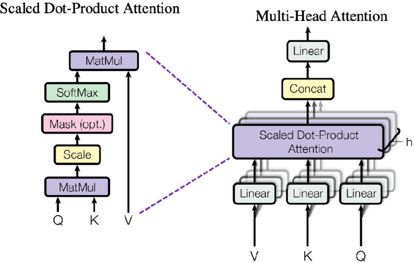

# Transformer Implementation: "Attention Is All You Need" 🚀
 

## 🌐 Overview
This project provides a TensorFlow implementation of the Transformer architecture as described in the paper "Attention Is All You Need" by Vaswani et al. The Transformer model is initially designed for sequence-to-sequence tasks such as machine translation.

## 📚 Background and Motivation
The Transformer model revolutionized natural language processing by introducing self-attention mechanisms and eliminating recurrent layers. This implementation aims to offer a clear and educational perspective on the model's workings.

## 🏗️Architecture Overview
- **Encoder**: Processes input sequences and generates representations.
- **Decoder**: Generates output sequences from the encoded representations.
- **Multi-Head Attention**: Allows the model to focus on different parts of the input sequence.
- **Positional Encoding**: Adds information about the position of tokens in the sequence.

## 🧠 Implementation Details
### 🔍 Self-Attention Mechanism

- **Overview**: Self-attention allows each token in the input sequence to weigh its relevance with every other token, enabling the model to capture dependencies and relationships regardless of their distance in the sequence.

- **Process**:
  - **Score Calculation**: Computes attention scores by performing matrix multiplication between the query and key vectors, scaled by the square root of the model dimension.
  - **Masking**: Applies a masking tensor to ignore certain positions (e.g., padding tokens) by adding a large negative value to the attention scores of those positions.
  - **Attention Weights**: Converts the scores into probabilities using the softmax function, adjusted by the masking to ensure proper attention.
  - **Output Generation**: Multiplies the attention weights by the value vectors to produce the final output of the self-attention layer.

### 🕵️‍♂️ Multi-Head Attention
- **Overview**: Multi-Head Attention allows the model to jointly attend to information from different representation subspaces at different positions. It uses multiple attention heads to capture various aspects of the relationships between tokens.
- **Process**: Performs self-attention multiple times in parallel with different linear projections of the queries, keys, and values. The outputs of these attention heads are concatenated and linearly transformed.

### 🔄 Encoder
- **Overview**: The Encoder processes the input sequence into a set of continuous representations. It consists of multiple layers, each including Multi-Head Attention and Feed-Forward Neural Networks.
- **Process**: Each encoder layer applies self-attention to the input sequence and then processes the result through a position-wise feed-forward network. Layer normalization and residual connections are used to stabilize training.
### 🔢 Decoder
- **Overview**: The Decoder generates the output sequence from the encoded representations. It includes mechanisms to attend to the encoder output and to previously generated tokens.
- **Process**: Each decoder layer applies self-attention to the previously generated tokens, attends to the encoder output using encoder-decoder attention, and processes the result through a position-wise feed-forward network. It also uses masking to prevent attending to future tokens.

### 📏 Positional Encoding
- **Overview**: Positional Encoding injects information about the position of tokens in the sequence into the embeddings. This allows the model to capture the order of tokens, which is crucial for understanding sequences.
- **Process**: Adds a positional encoding vector to each token's embedding. The positional encoding is typically computed using sine and cosine functions of different frequencies to encode token positions.

## 📚 References
- [📝 Paper - Attention Is All You Need
](https://proceedings.neurips.cc/paper_files/paper/2017/file/3f5ee243547dee91fbd053c1c4a845aa-Paper.pdf)
- [The Illustrated Transformer](https://jalammar.github.io/illustrated-transformer/) by Jay Alammar
- 🎥 [Transformer Model Explained](https://www.youtube.com/watch?v=XSSTuhyAmnI) - A YouTube video that provides an in-depth explanation of the Transformer architecture.